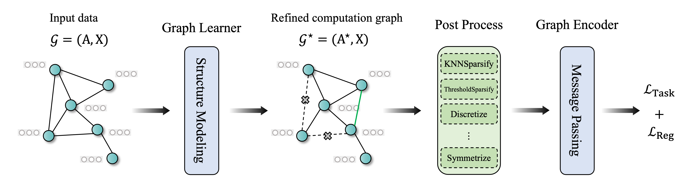

<p align="center">

</p>

# Graph Structure Learning Benchmark (GSLB)

GSLB is a Graph Structure Learning (GSL) library and benchmark based on [DGL](https://github.com/dmlc/dgl) and [PyTorch](https://pytorch.org/). We integrate diverse datasets and state-of-the-art GSL models.

## 📔 What is Graph Structure Learning?

<p align="center">

</p>

Graph Structure Learning (GSL) aims to optimize both the parameters of Graph Neural Networks (GNNs) and the computation graph structure simultaneously. GSL methods start with input features and an optimal initial graph structure. Its corresponding computation graph is iteratively refined through a structure learning module. With the refined computation graph ,GNNs are used to generate graph representations. Then parameters of the GNNs and the structure modeling module are jointly updated, either simultaneously or alternatively, util a preset stopping condition is satisfied.

If you want to explore more information about GSL, please refer to our [survey](https://www.researchgate.net/profile/Yanqiao-Zhu/publication/349787551_Deep_Graph_Structure_Learning_for_Robust_Representations_A_Survey/links/6137188538818c2eaf885a3f/Deep-Graph-Structure-Learning-for-Robust-Representations-A-Survey.pdf) and [paper collection](https://github.com/zepengzhang/awesome-graph-structure-learning).

## 🚀 Get Start

### Requirements

GSLB needs the following requirements to be satisfied beforehand:

* Python 3.8+
* PyTorch 1.13
* DGL 1.1+
* Scipy 1.9+
* Scikit-learn
* Numpy
* NetworkX
* ogb
* tqdm
* easydict
* PyYAML
* DeepRobust

### Installation via PyPI

To install GSLB with [`pip`](https://pip.pypa.io/en/stable/), simply run:

```
pip install GSLB
```

Then, you can import `GSL` from your current environment.

## Usage

If you want to quickly run an existing GSL model on a graph dataset:

```python
python main.py --dataset dataset_name --model model_name -n num_trails -g 0 --use_knn -k 5 --use_mettack --sparse --metric acc -p 0. --drop_rate 0. --add_rate 0.
```

Optional arguments:

``--dataset`` : the name of graph dataset

``--model`` : the name of GSL model

``--ntrail -n`` : repetition count of experiments

``--use_knn`` : whether to use knn graph instead of the original graph

``--k`` : the number of the nearest neighbors

``--drop_rate`` : the probability of randomly edge deletion

``--add_rate`` : the probability of randomly edge addition

``--mask_feat_rate`` : the probability of randomly mask features

``--use_mettack`` : whether to use the structure after being attacked by mettack

``--ptb_rate -p`` : the perturbation rate

``--metric`` : the evaluation metric

``--gpu_num -g`` : the selected GPU number

*Example: Train GRCN on Cora dataset, with the evaluation metric is accuracy.*

```
python main.py --dataset cora --model GRCN --metric acc
```

*If you want to quickly generate a perturbed graph by Mettack:*

```
python generate_attack.py --dataset cora --ptb_rate 0.05
```

Step 1: Load datasets

```python
from GSL.data import *

# load a homophilic or heterophilic graph dataset
data = Dataset(root='/tmp/', name='cora')

# load a perturbed graph dataset
data = Dataset(root='/tmp/', name='cora', use_mettack=True, ptb_rate=0.05)

# load a heterogeneous graph dataset
data = HeteroDataset(root='/tmp/', name='acm')

# load a graph-level dataset
data = GraphDataset(root='/tmp/', name='IMDB-BINARY', model='GCN')
```

Step 2: Initialize the GSL model

```python
from GSL.model import *
from GSL.utils import accuracy, macro_f1, micro_f1

model_name = 'GRCN'
metric = 'acc'
device = torch.device("cuda" if torch.cuda.is_available() else "cpu")

# the hyper-parameters are recorded in config
config_path = './configs/{}_config.yaml'.format(model_name.lower())

# select a evaluation metric
eval_metric = {
  'acc': accuracy,
  'macro-f1': macro_f1,
  'micro-f1': micro_f1
}[metric]

model = GRCN(data.num_feat, data.num_class, evel_metric,
            config_path, dataset_name, device)
```

Step 3: Train GSL model

```python
model.fit(data)
```

## 🧩 Implementation Algorithms

Currently, we have implemented the following GSL algorithms:

* GRCN [ECML PKDD 2020], *Graph-Revised Convolutional Network*
* ProGNN [KDD 2020], *Graph structure learning for robust graph neural networks*
* IDGL [NeurIPS 2020], *Iterative Deep Graph Learning for Graph Neural Networks: Better and Robust Node Embeddings*
* GEN [WWW 2021], *Graph Structure Estimation Neural Networks*
* CoGSL [WWW 2022], *Compact Graph Structure Learning via Mutual Information Compression*
* SLAPS [NeurIPS 2021], *SLAPS: Self-Supervision Improves Structure Learning for Graph Neural Networks*
* SUBLIME [WWW 2022], *Towards Unsupervised Deep Graph Structure Learning*
* STABLE [KDD 2022], *Reliable Representations Make A Stronger Defender: Unsupervised Structure Refinement for Robust GNN*
* NodeFormer [NeurIPS 2022], *NodeFormer: A Scalable Graph Structure Learning Transformer for Node Classification*
* HES-GSL [TNNLS 2023], *Homophily-Enhanced Self-Supervision for Graph Structure Learning: Insights and Directions*
* GTN [NeurIPS 2020], *Graph Transformer Networks*
* HGSL [AAAI 2021], *Heterogeneous Graph Structure Learning for Graph Neural Networks*
* HGP-SL [AAAI 2020], *Hierarchical Graph Pooling with Structure Learning*
* VIB-GSL [AAAI 2022], *Graph Structure Learning with Variational Information Bottleneck*

**Candidate algorithms**
* NeuralSparse [ICML 2020], *Robust Graph Representation Learning via Neural Sparsification*
* PTDNet [WSDM 2021], *Learning to Drop: Robust Graph Neural Network via Topological Denoising*
